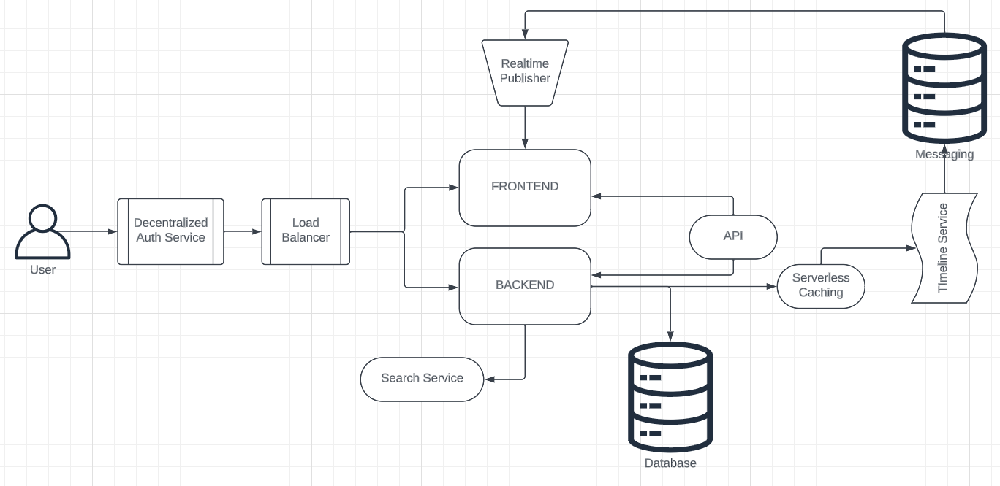

# Week 0 — Billing and Architecture

1. Destroy your root account credentials, Set MFA, IAM role

2. Use EventBridge to hookup Health Dashboard to SNS and send notification when there is a service health issue.

3. Review all the questions of each pillars in the Well Architected Tool (No specialized lens)

4. Create an architectural diagram (to the best of your ability) the CI/CD logical pipeline in Lucid Charts

- Rough Architecture:

5. Research the technical and service limits of specific services and how they could impact the technical path for technical flexibility.

6. Open a support ticket and request a service limit

#### Homework
- Used Eventbridge to hookup Health dashboard to SNS for a notification if there is a service health issue.